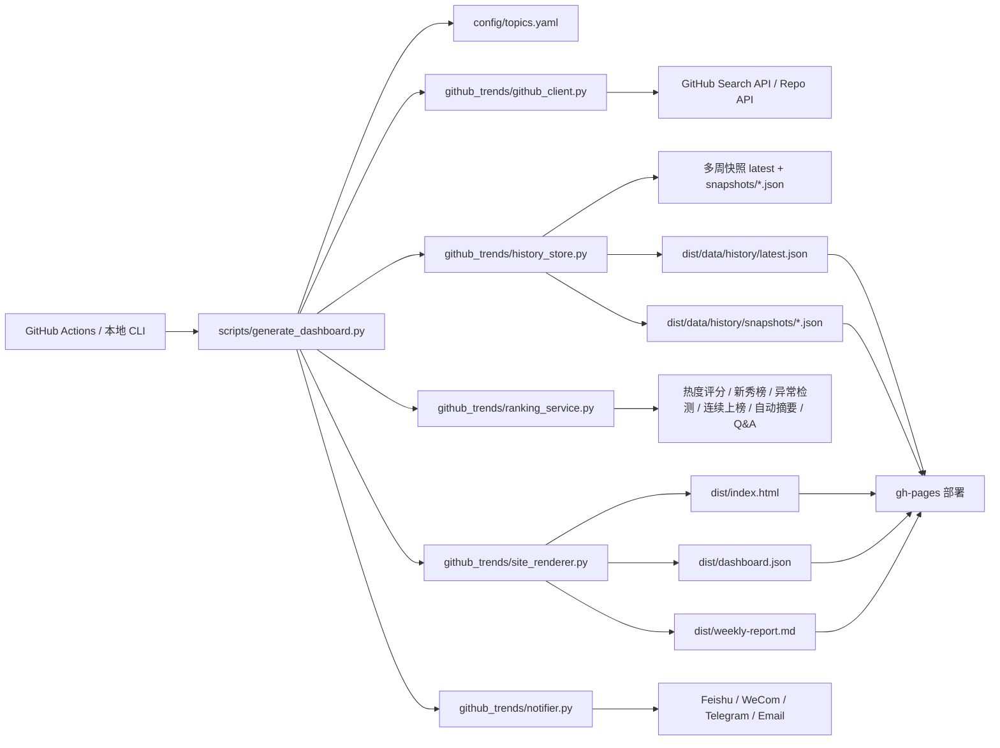

# 项目架构图

## 模块职责

- `github_trends/config.py`
  - 加载行业配置、常量与基础路径参数。
- `github_trends/github_client.py`
  - GitHub API 访问、缓存、限流与 README 抓取。
- `github_trends/history_store.py`
  - 最新快照、历史归档、榜单变化对比。
- `github_trends/ranking_service.py`
  - 热度评分、新秀榜、异常检测、连续上榜、自动摘要、问答逻辑。
- `github_trends/site_renderer.py`
  - 输出 HTML、`dashboard.json` 和 Markdown 周报。
- `github_trends/notifier.py`
  - 报告订阅推送与失败通知。
